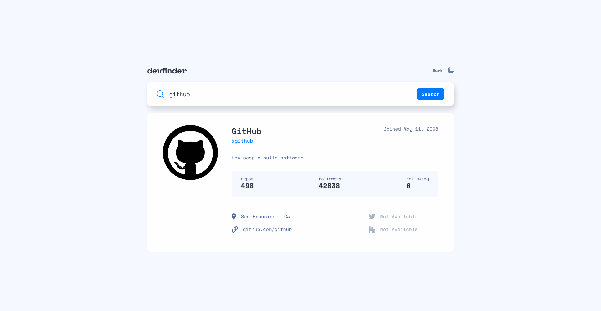

# Frontend Mentor - GitHub user search app solution

This is a solution to the [GitHub user search app challenge on Frontend Mentor](https://www.frontendmentor.io/challenges/github-user-search-app-Q09YOgaH6). Frontend Mentor challenges help you improve your coding skills by building realistic projects.

## Table of contents

- [Overview](#overview)
  - [The challenge](#the-challenge)
  - [Screenshot](#screenshot)
  - [Links](#links)
- [My process](#my-process)
  - [Built with](#built-with)
  - [What I learned](#what-i-learned)
  - [Useful resources](#useful-resources)
- [Author](#author)

## Overview

### The challenge

Users should be able to:

- View the optimal layout for the app depending on their device's screen size
- See hover states for all interactive elements on the page
- Search for GitHub users by their username
- See relevant user information based on their search
- Switch between light and dark themes
- **Bonus**: Have the correct color scheme chosen for them based on their computer preferences. _Hint_: Research `prefers-color-scheme` in CSS.

### Screenshot

### Links

- Solution URL: [https://github.com/LukasT1/fm-junior-github-user-search-app]
- Live Site URL: [https://LukasT1.github.io/fm-junior-github-user-search-app]

## My process

### Built with

- Semantic HTML5 markup
- CSS custom properties
- Flexbox
- CSS Grid
- Desktop-first workflow

### What I learned

- Learned about the query for user preffered color mode.
- Learned more about debounce function, although i did not use it in the end.
- I learned how to work with color modes, so it is quit straigthforward. What I did is applied two classes "light-mode" and "dark-mode" to the whole body element. And everytime I setup color that was meant to be changed I did this in those respective classes.

### Useful resources

- [https://www.freecodecamp.org/news/javascript-debounce-example/] - Good explanation for the debounce function.

- [Example resource 2](https://www.example.com) - This is an amazing article which helped me finally understand XYZ. I'd recommend it to anyone still learning this concept.

## Author

- Frontend Mentor - [https://www.frontendmentor.io/profile/LukasT1]
